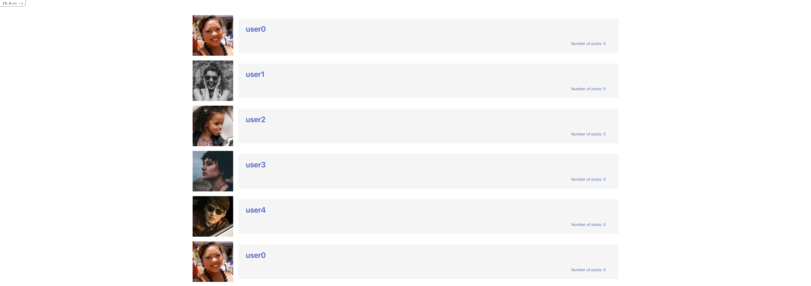

# Blog App

> Classic blog website


A simple blog app built using the Ruby on Rails framework.

## Built With

- Ruby on Rails
- PostgreSQL

## Getting Started

To get a local copy up and running follow these simple example steps.

### Prerequisites

- [Ruby](https://www.ruby-lang.org/en/)
- [Rails](https://gorails.com/)

### Setup

- Make sure you have Ruby on Rails set up properly on your computer
- Clone or download this repo on your machine
- Enter project directory

### Development Database

```sh
# Create user
sudo -u postgres createuser blog -s
```

```sh
# test the view
rake db:reset # this will drop the database, create it, and load the schema and run the seed data
```

### Install

```sh
bundle install
```

### Run

```sh
rails s
```

### Test

```sh
rake rspec
```
#### IF TESTS FAIL
```sh
RAILS_ENV=test rake db:reset
``
<br>
then
<br>
```sh
rake db:seed
```

## Author

👤 **Daniel M. Matongo**

- GitHub: [@mmatongo](https://github.com/mmatongo)
- LinkedIn: [Daniel M. matongo](https://linkedin.com/in/mmatongo)

## 🤝 Contributing

Contributions, issues, and feature requests are welcome!

Feel free to check the [issues page](../../issues/).

## Show your support

Give a ⭐️ if you like this project!

## Acknowledgments

- Microverse

## License

[MIT](./LICENSE)
