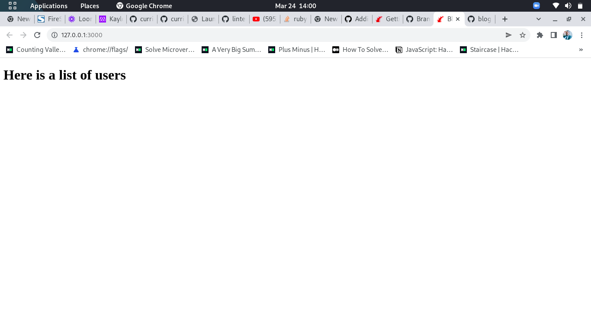

# Blog App

>  Blog website


A simple blog app built using the Ruby on Rails framework.

## Built With

- Ruby on Rails
- PostgreSQL

## Getting Started

To get a local copy up and running follow these simple example steps.

### Prerequisites

- [Ruby](https://www.ruby-lang.org/en/)
- [Rails](https://gorails.com/)

### Setup

- Make sure you have Ruby on Rails set up properly on your computer
- Clone or download this repo on your machine
- Enter project directory

### Development Database

```sh
# Create user
sudo -u postgres createuser blog -s
# Create the database
rake db:create
# Create database Migration
rails db:migrate
```

### Install

```sh
bundle install
```

### Run

```sh
rails s
```

### Test

```sh
rspec
```

## Author

👤 **Kalolo Chola Lemba**
- GitHub: [@KayLemba ](https://github.com/KayLemba)
- Twitter: [@King-Kaylo1 ](https://twitter.com/King_Kaylo1) 
- LinkedIn: [@kalolo-lemba](https://www.linkedin.com/in/https://www.linkedin.com/in/kalolo-lemba)


## 🤝 Contributing

Contributions, issues, and feature requests are welcome!

Feel free to check the [issues page](../../issues/).

## Show your support

Give a ⭐️ if you like this project!

## Acknowledgments

- Microverse

## License

[MIT](./LICENSE)
